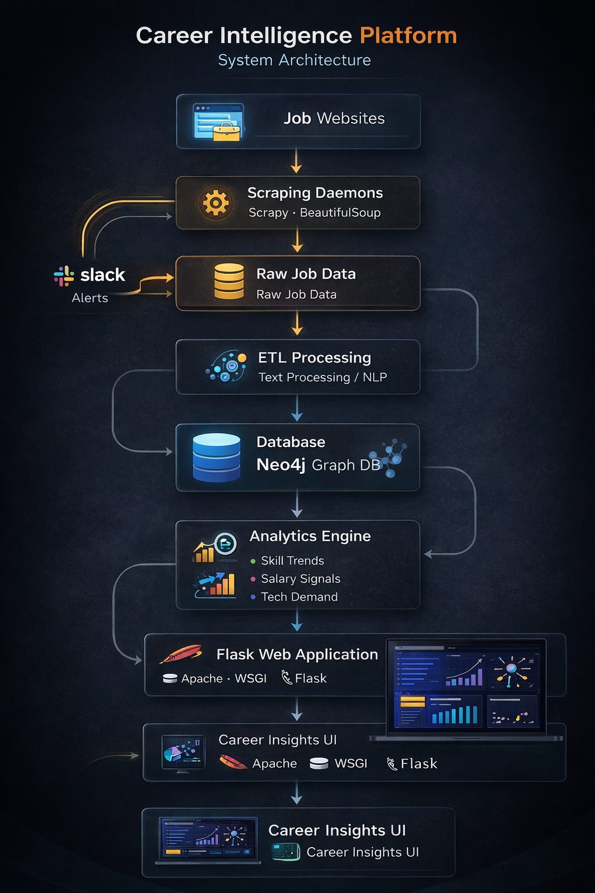

# Career Intelligence Platform

### Technologies


A data-driven platform that analyzes real-world job postings to extract labor market signals and generate career
insights based on actual hiring demand.

Originally developed as a postgraduate capstone project, this system collects job listings from online sources,
processes unstructured text, extracts structured information such as required skills and salary ranges, and generates
analytical insights that can support data-informed career decisions.

The project demonstrates a full data pipeline including web data collection, data normalization, structural analysis and
visualization.


---

# Overview

Career decisions are often based on intuition, incomplete information or informal advice. This project explores an
alternative approach: using large-scale job market data to understand which skills, tools and qualifications are
actually demanded by employers.

By collecting and analyzing job postings from multiple sources, the platform identifies patterns in hiring requirements,
skill demand and salary signals, transforming raw job listings into structured and analyzable labor market intelligence.

### Domain


---

# Key Features

• Automated collection of job postings from online sources  
• Normalization of unstructured job descriptions  
• Extraction of structured signals such as skills and salary ranges  
• Detection of technology trends and skill demand  
• Analytical exploration of job market patterns  
• Interactive visualization of relationships between jobs, skills and salary signals  
• Web-based interface for browsing insights and reports

---

# System Architecture


The platform follows a modular architecture that separates data collection, processing, analysis and presentation.



___
**Job Websites<br>&nbsp;&nbsp;&nbsp;&nbsp;&nbsp;↓<br>**
**Data Collection Daemons <br>&nbsp;&nbsp;&nbsp;&nbsp;&nbsp;↓<br>**
**Raw Job Text Data <br>&nbsp;&nbsp;&nbsp;&nbsp;&nbsp;↓<br>**
**Data Normalization and Processing <br>&nbsp;&nbsp;&nbsp;&nbsp;&nbsp;↓<br>**
**Structural Extraction (skills, salary ranges, technologies) <br>&nbsp;&nbsp;&nbsp;&nbsp;&nbsp;↓<br>**
**Database Storage <br>&nbsp;&nbsp;&nbsp;&nbsp;&nbsp;↓<br>**
**Analysis and Reporting <br>&nbsp;&nbsp;&nbsp;&nbsp;&nbsp;↓<br>**
**Web Interface**
___

This architecture allows the system to transform raw job listings into structured labor market intelligence.

---

# Project Structure

**daemons/** &nbsp;&nbsp;&nbsp;→&nbsp;&nbsp;&nbsp; automated job data collection<br>
**process_data/** &nbsp;&nbsp;&nbsp;→&nbsp;&nbsp;&nbsp; normalization and structural processing<br>
**custom_libs/** &nbsp;&nbsp;&nbsp;→&nbsp;&nbsp;&nbsp; shared utilities and scraping logic<br>
**templates/** &nbsp;&nbsp;&nbsp;→&nbsp;&nbsp;&nbsp; web interface templates<br>
**static/** &nbsp;&nbsp;&nbsp;→&nbsp;&nbsp;&nbsp; frontend assets<br>
**webservice.py** &nbsp;&nbsp;&nbsp;→&nbsp;&nbsp;&nbsp; main Flask application<br>
**db_utils.py** &nbsp;&nbsp;&nbsp;→&nbsp;&nbsp;&nbsp; database access utilities<br>
**requirements.txt** &nbsp;&nbsp;&nbsp;→&nbsp;&nbsp;&nbsp; project dependencies

---

# How to Run

## Prerequisites

Before running the project, make sure you have:

- Python 3.10+
- Neo4j running locally or remotely
- `pip` available
- internet access for scraping job sources
- NLTK corpora required by the processing scripts

Clone the repository

```bash
git clone <your-repository-url>
cd career-intelligence-platform
```

### Minimal End-to-End Flow

A minimal local execution flow looks like this:

- start Neo4j
- configure .env
- run the scraping layer
- run the processing/population scripts
- start webservice.py
- open the web UI in the browser

---

# Core Components

## Data Collection Layer

The system includes automated daemons responsible for collecting job postings from online job portals. These components
extract job descriptions, titles, salary information and other relevant fields.

The collected data is normalized and stored in structured files for downstream processing.

---

## Data Processing Layer

Raw job descriptions often contain noisy, unstructured text. The processing layer cleans and normalizes the content,
preparing it for structural extraction and analysis.

This stage includes:

- text normalization
- tokenization
- removal of irrelevant terms
- preparation of job descriptions for structured analysis

---

## Structural Extraction Layer

This component extracts meaningful entities from job descriptions, including:

- salary ranges
- technologies and tools
- database systems
- programming languages
- professional roles and experience levels

These entities are dynamically structured to allow analytical exploration.

---

## Analysis Layer

The analysis layer connects to the structured data and generates insights such as:

- skill demand patterns
- relationships between roles and technologies
- salary trends
- frequency of technologies across job postings

These analyses provide a data-driven view of labor market demand.

---

## Web Visualization Layer

A Flask-based web application provides an interface for exploring the processed data. Through the UI it is possible to:

- browse job postings
- analyze skill relationships
- explore salary signals
- visualize technology demand patterns

This layer demonstrates how collected data can be transformed into actionable insights.

---

## System Modules

The **Career Intelligence Platform** is composed of several modular components, each responsible for a specific stage of the data pipeline, from job data collection to analysis and visualization.

Below are the experiments and tests I conducted during the process of consolidating the concepts that make up the application.

---

### Data Collection Layer

#### Daemons  
https://bitbucket.org/taylor3lewis/daemons/src/master/app/daemons/

Automated data collection daemons responsible for extracting job postings from online job websites.  
These components parse job listings, normalize the extracted content, and store the raw data in text format for downstream processing.

---

### Data Ingestion Layer

#### Populator  
https://bitbucket.org/taylor3lewis/populator/src/master/

Responsible for ingesting the collected job data into the database.  
This component transforms the raw extracted data into structured records suitable for analysis and querying.

---

### Structural Processing Layer

#### Structural Nodes  
https://bitbucket.org/taylor3lewis/structural-nodes/src/master/

Responsible for dynamically creating structured entities from unstructured job descriptions.

Examples include:

- extracting salary ranges  
- identifying technologies such as programming languages or database systems  
- organizing skills and technologies into structured categories  

This layer enables the system to convert raw textual job descriptions into analyzable data.

---

### Analytics Layer

#### Analysis  
https://bitbucket.org/taylor3lewis/analysis/src/master/

Connects to the database and performs analytical processing on the stored data, generating reports, relationships, and visual insights related to job market trends, technology demand, and salary patterns.

---

### Presentation Layer

#### User Interface  
https://bitbucket.org/taylor3lewis/user-interface/src/master/

Frontend application responsible for presenting the results of the analysis.  
It allows users to explore job postings, visualize relationships between skills and technologies, and interact with the insights generated by the platform.

---

## Data Flow

The overall system follows this pipeline:
___

# Technology Stack

Python  
Flask  
Web Scraping  
Data Processing Pipelines  
Text Processing  
CSV-based intermediate data storage  
HTML / CSS / JavaScript for visualization

---

# Academic Context

This project was originally developed as a postgraduate capstone project focused on the intersection of labor market
analytics, web data collection and career guidance.

The goal was to explore how large-scale job data could be used to better understand market demand and support career
decision-making.

---

# My Role

I designed and implemented the architecture and core components of the platform, including:

• data collection daemons  
• scraping and normalization pipelines  
• structural extraction logic  
• analysis and reporting modules  
• backend web application  
• visualization interface

---


# Future Improvements

Possible future evolutions of the project include:

• real-time data pipelines  
• machine learning models for skill trend forecasting  
• recommendation engines for career paths  
• modern API-based architecture  
• cloud-native deployment and distributed processing

---

# License

This repository is shared for educational and demonstration purposes.


